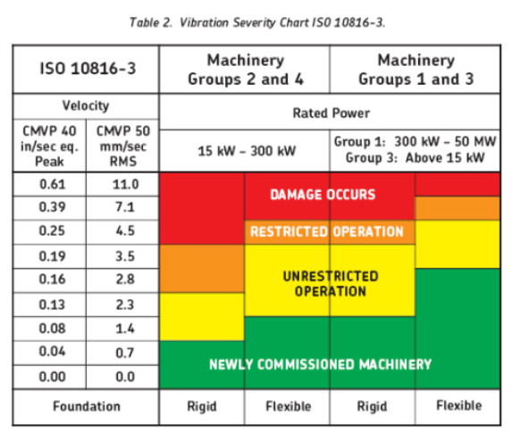
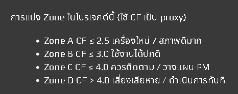

# การวิเคราะห์รูปคลื่นความสั่นสะเทือน — ISO 10816-3 (Vibration Waveform Analysis)

เวอร์ชัน 6 | รูปแบบ Jupyter Notebook (v3_fixed)

---

## ภาพรวม (Overview)






เครื่องมือวิเคราะห์รูปคลื่นความสั่นสะเทือนผ่าน Jupyter Notebook สำหรับติดตามสภาพการทำงานของเครื่องจักรหมุน (Rotating Machinery) Notebook นี้จะประมวลผลข้อมูลความเร่ง (Accelerometer) ดิบรูปแบบ .txt, ตรวจสอบคุณภาพของสัญญาณ, ตัดข้อมูลที่ผิดปกติ (Outliers) ออก, คำนวณค่าตัวชี้วัดความสั่นสะเทือนที่สำคัญ (รวมถึงการแปลงเป็น Velocity), และสร้างกราฟวิเคราะห์พร้อมรายงาน CSV ที่สอดคล้องกับมาตรฐาน ISO 10816-3

ออกแบบมาสำหรับการวัดผล 2–5 ระยะเวลา (Periods) และในเวอร์ชันนี้มีการรวบรวม **Session 7/7a** สำหรับทำนาย (Forecast) ค่า RMS / CF / Kurtosis ของ period ถัดไปด้วย **Linear Regression** และแสดงกราฟแนวโน้มอัตโนมัติ

การทำงานของระบบแบ่งออกเป็น 4 ขั้นตอนหลัก:
1. **Signal Processing & Cleaning** — กรอง Outlier/Spike, แปลง Acceleration (G) เป็น Velocity (mm/s, in/s)
2. **Metrics Computation** — คำนวณ RMS, Peak, Crest Factor (CF), FFT, Kurtosis, Skewness
3. **ISO 10816-3 Zoning** — จัดหมวดหมู่โซน A / B / C / D ตามค่า **Velocity RMS (mm/s)**
4. **Trend Analysis & Forecast** — วิเคราะห์ทิศทางแนวโน้มและคาดการณ์ period ถัดไปด้วย Linear Regression

---

## ความต้องการของระบบ (Requirements)

```
Python >= 3.9
scipy
matplotlib
numpy
pandas
scikit-learn
```

ติดตั้งไลบรารี:

```bash
pip install scipy matplotlib numpy pandas scikit-learn
```

---

## โครงสร้างไฟล์ (File Structure)

```
project/
├── vibration_analysis_v3_fixed.ipynb    # Notebook หลัก (เวอร์ชันล่าสุด)
├── output/                              # สร้างอัตโนมัติเมื่อรันครั้งแรก
│   ├── outlier_diag_<period>.png
│   ├── raw_data_<period>.png
│   ├── signal_quality_dashboard.png
│   ├── vibration_analysis.png
│   └── vibration_full_report.csv
└── README.md
```

---

## รูปแบบไฟล์ข้อมูลนำเข้า (Input File Format)

ไฟล์ข้อความธรรมดา (.txt) โดยแต่ละไฟล์ต้องประกอบด้วย:

- บรรทัดส่วนหัว (Header) ที่มีฟิลด์ `Equipment:`, `Meas. Point:`, `Date/Time:`, `Amplitude:`
- ข้อมูลตัวเลข 2 คอลัมน์: เวลา (ms) และ ความเร่ง (G)

ตัวอย่างส่วนหัวของไฟล์:

```text
Equipment:    Motor Compressor OAH-06_A
Meas. Point:  A_CH-06
Date/Time:    28-Jun-24 08:56:47  Amplitude: G
---
0.0000   0.0123
0.1000  -0.0045
...
```

รูปแบบวันที่ที่รองรับ: `DD-Mon-YY HH:MM:SS`, `DD-Mon-YYYY HH:MM:SS`, `DD-MM-YYYY HH:MM:SS`, `YYYY-MM-DD HH:MM:SS`

---

## ตัวชี้วัดที่คำนวณ (Vibration Parameters)

| Parameter    | ความหมาย | หน่วย |
| ------------ | -------- | ----- |
| **RMS (mm/s)** | พลังงานการสั่นสะเทือน (ตามมาตรฐาน ISO) | mm/s |
| **Peak (in/s)** | ค่าความเร็วสูงสุด (Velocity Peak) | in/s |
| RMS (G) | พลังงานความเร่ง | G |
| Peak (G) | ค่าความเร่งสูงสุด | G |
| Crest Factor | อัตราส่วน Peak/RMS — บ่งชี้ impulse fault | - |
| Kurtosis | ความแหลมของการกระจาย — บ่งชี้ bearing damage | - |
| Skewness | ความเบ้ของ distribution | - |
| FFT | การวิเคราะห์ความถี่หลัก (Dominant Frequencies) | Hz |

---

## เซสชั่นต่างๆ (Sessions)

Notebook ถูกแบ่งออกเป็นส่วนๆ (Session) ต้องรันตามลำดับ:

### Session 0 — Setup and Imports
นำเข้าไลบรารีทั้งหมด ตั้งค่าคงที่สำหรับการแปลงความเร็ว (Velocity Conversion constants)

### Session 0b — Parser
กำหนดฟังก์ชัน `parse_waveform_txt()` สำหรับอ่านไฟล์ .txt และ `parse_dt()` สำหรับจัดการวันที่

### Session 0c — Signal Processing
ฟังก์ชันหลัก: `remove_outliers()`, `integrate_to_velocity()` (แปลง G เป็น mm/s), `compute_metrics()`, `iso_zone()`, `compute_fft()`

### Session 1 — Load Files
เปิดหน้าต่างเลือกไฟล์ (tkinter) เพื่อเลือกไฟล์ .txt จำนวน 2–5 ไฟล์

### Session 2 — Outlier Config
ตั้งค่าพารามิเตอร์การจัดการ Outlier (ปรับค่า `IQR_MULTIPLIER` และ `TRIM_START_MS` ได้ที่นี่)

### Session 3 — Parse and Clean Data
โหลดและทำความสะอาดข้อมูล พร้อมแสดงกราฟ **Outlier Diagnostic** ทีละไฟล์ทันที

### Session 3b — Raw Data Plots
แสดงกราฟข้อมูลดิบ 4 กราฟย่อยต่อไฟล์: Waveform / Zoom / FFT / Histogram+Stats

### Session 3c — Signal Quality Dashboard & Audit
- **Signal Quality Dashboard**: ตรวจสอบคุณภาพสัญญาณ (Spikes, Flat signal, Rolling RMS)
- **Outlier Removal Audit**: ตรวจสอบรายการข้อมูลที่ถูกแก้ไขและเปรียบเทียบค่าทางสถิติ Raw vs Clean

### Session 4 — Data Validation
ตรวจสอบและ flag ไฟล์ที่มีข้อมูลเสียหาย (Peak overrange, CF สูงผิดปกติ, Kurtosis สูงมาก, Flat signal)

### Session 4b — Dataset Selection
สร้างตัวแปร `ds_valid` (เลือกใช้เฉพาะไฟล์ที่ผ่าน Validation หรือ Force include ทั้งหมด)

### Session 5 — Metric Summary Table
ตารางสรุปตัวชี้วัดเปรียบเทียบทุก Period (RMS, Peak, CF, Kurtosis, Skewness)

### Session 6 — Main Analysis Plots
กราฟภาพรวม (บันทึกใน `output/vibration_analysis.png`):
- Waveform + Spike markers
- FFT spectrum เปรียบเทียบทุก period
- Trend lines (RMS / Peak / CF)
- 200ms Zoom Overlay

### Session 7 — Diagnostic Summary & Trend
สรุปสภาพเครื่องจักรปัจจุบันตามโซน ISO, flag เตือนต่างๆ และแสดงทิศทางแนวโน้ม (Linear slope)

### Session 7a — Trend Forecast (Linear Regression)
คำนวณและคาดการณ์ค่าใน Period ถัดไปโดยใช้ **Linear Regression** พร้อมกราฟแนวโน้มแบบ 2x2

### Session 8 — Build DataFrames & Export CSV
จัดทำรายงานและส่งออกไฟล์ `output/vibration_full_report.csv` (ประกอบด้วย 6 ส่วนหลัก รวมถึง Forecast)

---

## ลำดับการรัน (Run Order)

```
Session 0 → 0b → 0c → 1 → 2 → 3 → 3b → 3c → 4 → 4b
         → 5 → 6 → 7 → 7a → 8
```

---

## ส่วนอ้างอิงมาตรฐาน ISO 10816-3

ในเวอร์ชันนี้ ระบบประเมิน **Zone** ตามค่า **Velocity RMS (mm/s)** (สำหรับ Group 2 & 4, Rigid mount)

| Zone | ช่วงค่า (mm/s) | สภาวะเครื่องจักร |
|---|---|---|
| A | ≤ 0.7 | ใหม่ / ทำงานปกติดี (Newly Commissioned) |
| B | ≤ 1.4 | ทำงานได้ต่อเนื่อง (Unrestricted Operation) |
| C | ≤ 2.8 | ระมัดระวัง (Restricted Operation — Monitor) |
| D | ≤ 4.5 | เสี่ยงพัง (DANGER) |
| E | > 4.5 | อันตรายรุนแรง (Critical Damage) |

---

## ข้อจำกัดที่ควรทราบ (Known Limitations)

- **Linear Regression**: การพยากรณ์ในเวอร์ชันนี้ใช้ Linear Regression เพื่อลด Overfitting (ต้องการข้อมูล 2-5 periods)
- **Velocity Integration**: ใช้ FFT Integration ร่วมกับ HP filter เพื่อลดการ drift ของค่าความเร็ว
- **IQ_MULTIPLIER**: แนะนำใช้ค่า **1.5** สำหรับการตัด Spike ที่เข้มงวด
- **Frequency Resolution**: ขึ้นอยู่กับอัตราการสุ่มตัวอย่าง (Sample Rate) และจำนวนจุดของไฟล์นำเข้า

---

## ไฟล์เอาต์พุต (Output Files)

| ชื่อไฟล์ | คำอธิบาย |
|---|---|
| `outlier_diag_<period>.png` | กราฟวินิจฉัย Outlier รายไฟล์ |
| `raw_data_<period>.png` | กราฟข้อมูลดิบ Waveform/FFT/Stats |
| `signal_quality_dashboard.png` | Dashboard คุณภาพสัญญาณก่อนการทำความสะอาด |
| `vibration_analysis.png` | กราฟภาพรวมผลวิเคราะห์ทุก period |
| `vibration_full_report.csv` | รายงานฉับเต็ม รวมถึงค่าพยากรณ์แนวโน้ม |
